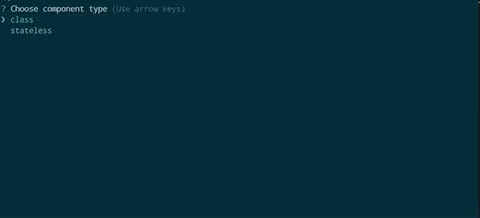

[]()
[]()
[]()



Updated to contain lifecycle methods from react 16.6.0+

**Note** This means UNSAFE methods are added by default.

# Add React components from cli

- Supports JSX flavoured components
- Can make class (stateful) or stateless component
- Uses UMD (universal module syntax) for wider support

  Commands:

### Installation

Add as a global

```javascript
yarn add add-react -g
```

or

```javascript
npm install add-react -g
```

or to add to current project only

```javascript
yarn add add-react
```

To use:

```javascript
add-react <command>
```

### Commands

```javascript
component | c;
```

Adds a new react component, this will walk you through a few steps to create the component
example:

```javascript
add-react component
```

or

```javascript
add-react c
```

### Options:

add-react supports two component types

#### Stateless (functional)

Stateless functional component only has 2 configuration options:

- Component name
- Filename

#### ES6 Class

Es6 class contain boilerplate code for stateful component extending react.component.
Has 3 options:

- Component name
- Filename
- LifecycleMethods - if 'true' boilerplate contains all default react components.

---

### Example Component:

```javascript
const React = require("react");

class Navigation extends React.Component {
  constructor(props) {
    super(props);
    this.state = {};
  }
  static getDerivedStateFromProps(props, state) {
    return {};
  }

  UNSAFE_componentWillMount() {}

  componentDidMount() {}

  UNSAFE_componentWillReceiveProps() {}

  shouldComponentUpdate() {}

  UNSAFE_componentWillUpdate() {}

  componentDidUpdate() {}

  componentWillUnmount() {}

  render() {
    return <div />;
  }
}

module.exports = Navigation;
```

### CLI only

If you prefer to just use a one liner and not go through the questions you can use the following:

```javascript
add-react cli <componentType> <componentName> <filename> [lifecycle]
```

```
componentType
```

_Class_ or _Stateless_

```javascript
componentName;
```

Component Name

```javascript
filename;
```

filename - e.g Component.jsx

```javascript
lifecycle;
```

_boolean_ - whether class (stateful) component should contain all lifecycle methods

#### Options

-V, --version output the version number

-h, --help output usage information
